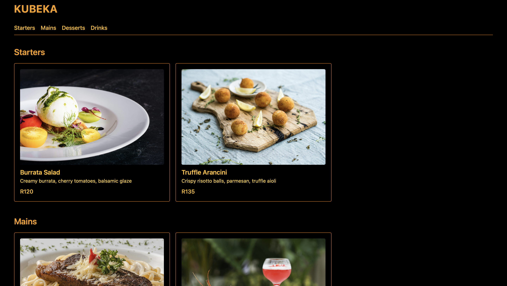

# 🍽️ Restaurant Menu Order Page

This is a simple, responsive HTML-only restaurant menu that allows users to place orders via WhatsApp. Built as part of my front-end learning journey.

## 📱 Features

- Fully responsive design
- Menu items listed with prices
- WhatsApp link to send order

## 🛠️ Tech Stack

- HTML
- WhatsApp API link integration

## 🚀 Live Demo

👉 [Click here to view the live site](https://leafy-donut-18c866.netlify.app)  

## 📸 Screenshot

  

## 📂 How to Use

1. Clone the repo  
2. Open `index.html` in your browser  
3. Browse the menu and try the WhatsApp order link

## 🧠 What I Learned

- How to structure a simple HTML page
- How to create responsive layouts
- How to link to WhatsApp with custom messages

## ✍️ Author

**Tshepo Kubeka**  
[GitHub Profile](https://github.com/TshepoKubeka)
